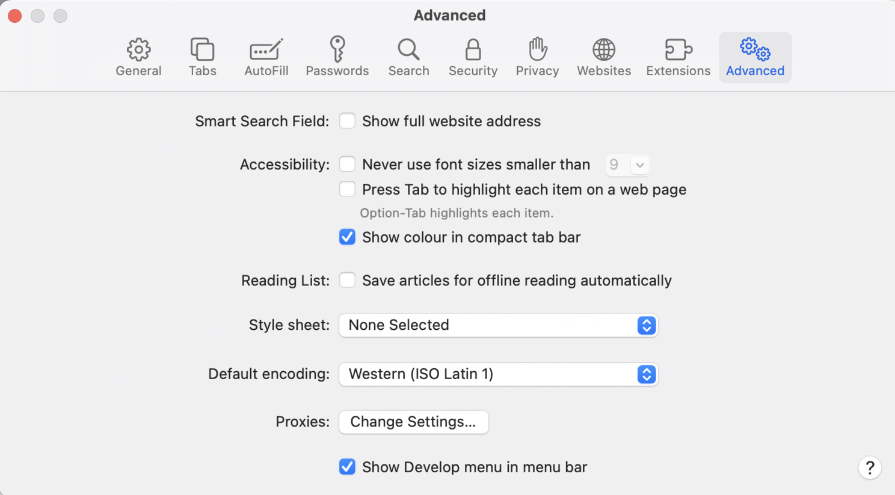
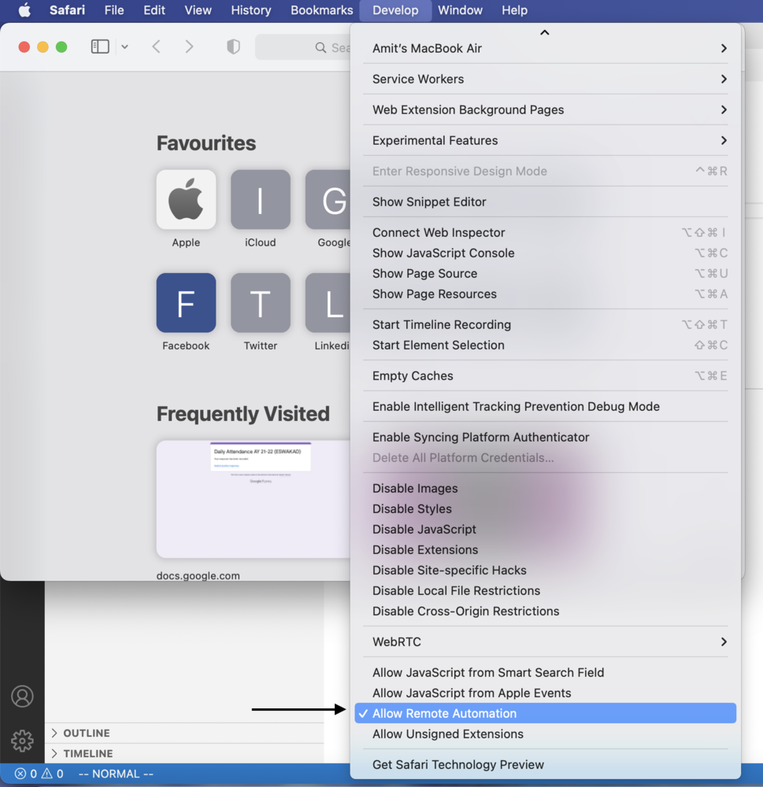

# Yamaha Media Downloader

This project provides a **single Python tool** that automatically downloads all practice audios from the **Yamaha Music Schools** books and courses available on the official media pages.

The script opens the target Yamaha Media page in **Safari** or in a **Chromium-based browser (Brave, Chrome or Edge)**, simulates clicks to load every track, and saves the audio files locally with proper filenames.

---

## 📦 Requirements

- macOS (tested)
- [Python 3.9+](https://www.python.org/downloads/)
- A Chromium-based browser:
  - [Brave Browser](https://brave.com/download/)
  - [Google Chrome](https://www.google.com/chrome/)
  - [Microsoft Edge](https://www.microsoft.com/edge)
- Internet connection

> **Note:** The setup script will automatically detect your installed browser and download a compatible WebDriver version.

> **Note:** Manual configuration is no longer necessary in most cases

> **Note:** Support for Safari requires extra configuration steps.

---

## 🚀 Setup & Installation

This project includes an automatic setup script for macOS to make installation simple.

### 1. Clone the repository
```
git clone https://github.com/emilio-devesa/YamahaMediaDownloader.git
cd YamahaMediaDownloader
```

### 2. Install dependencies
```
./setup.sh
```
This script will:
- Create and activate a Python virtual environment
- Install all dependencies listed in `requirements.txt`
- Detect your installed browser (Brave, Chrome, Edge, or Safari)
- Extract its version and automatically install the correct WebDriver
- Store the browser path and environment settings in a `.env` file for future runs

### 3. Activate environment
```
source venv/bin/activate
```

## 🎵 Usage

All course URLs are defined in `data/courses.txt` using a simple key-value format.
To download all audios for a specific course, just pass the course key as an argument. For example:
```
python src/yamaha_media_downloader.py drums_1
```
Audio files will be saved in a subfolder automatically created in the current directory:
```
yamaha_drums_1/
```

## ⚙️ Configuration

You can edit your `.env` file at any time to update browser paths or WebDriver paths:
```
BROWSER="brave"
BROWSER_PATH="/Applications/Brave Browser.app/Contents/MacOS/Brave Browser"
CHROMEDRIVER_PATH="/usr/local/bin/chromedriver"
```

To enable headless mode (run without opening a browser window), uncomment this line inside the script:
```
# options.add_argument("--headless")
```

## 🧩 Technical Notes

- The browser and driver management logic is now handled by `src/browser_factory.py`, which automatically:
    - Detects the browser
    - Matches and installs the correct driver version
    - Configures Selenium accordingly
- Supports Brave, Chrome, Edge, and Safari
- The script uses **Selenium WebDriver** to automate the browser.
- Each file is saved using the title displayed on the Yamaha Media page (e.g. `02-01 Chapter 1 - 4th Rhythm Pattern 2.mp3`).
- You can easily add new courses by editing `data/courses.txt`

## 🧭 Safari configuration

To use Safari, the user needs to activate the "Allow Remote Automation" option:
- Open Safari settings
- Go to the "Advanced" tab
- Activate "Show Develop menu in menu bar"
- Open the Developer menu in the menu bar and activate the "Allow Remote Automation" option





## 🪪 License

This repository is for **educational and personal use only**.

All rights to the audio content belong to **Yamaha Corporation**.
